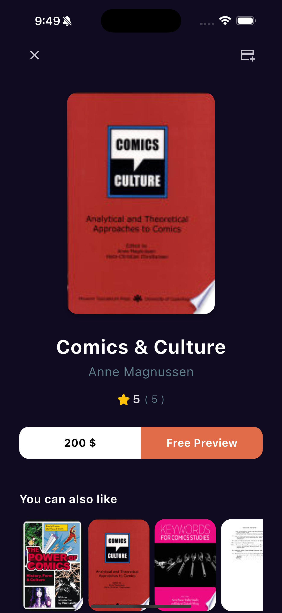
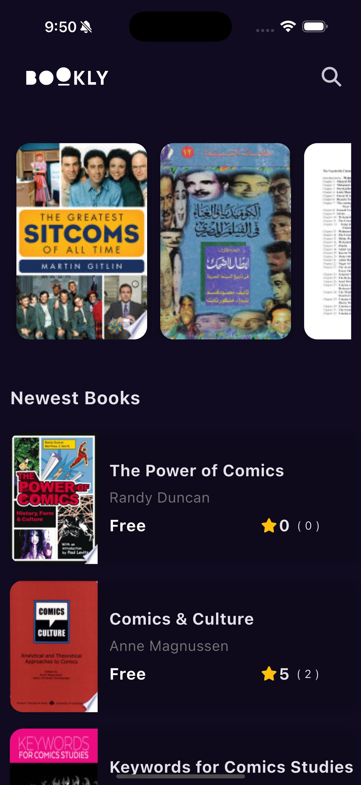

# Bookly (Novella)

A modern Flutter application for discovering, searching, and exploring books using the Google Books API.

## Features

- **Google Books API Integration**: Fetches books, details, and search results from Google Books.
- **State Management with Bloc**: Uses `flutter_bloc` for robust, scalable state management.
- **Dependency Injection**: Powered by `get_it` for clean and testable code.
- **Search with Debounce**: Real-time search with debounce to minimize API calls and improve UX.
- **API Response Caching**: Prevents duplicate requests and reduces rate limiting.
- **Error Handling**: User-friendly error messages for network and API issues.
- **Book Details View**: Rich details including cover, author, rating, and more.
- **Similar Books**: Suggests similar books based on category.
- **Responsive UI**: Adapts to different screen sizes and orientations.
- **Custom Widgets**: Reusable widgets for book items, ratings, and buttons.
- **Theming**: Modern dark theme with custom colors.
- **Navigation**: Uses `go_router` for declarative, scalable navigation.
- **.env Support**: API keys and secrets are managed securely with `flutter_dotenv`.
- **Image Caching**: Uses `cached_network_image` for efficient image loading.

## Packages Used

- [flutter_bloc](https://pub.dev/packages/flutter_bloc)
- [get_it](https://pub.dev/packages/get_it)
- [dio](https://pub.dev/packages/dio)
- [go_router](https://pub.dev/packages/go_router)
- [cached_network_image](https://pub.dev/packages/cached_network_image)
- [font_awesome_flutter](https://pub.dev/packages/font_awesome_flutter)
- [flutter_dotenv](https://pub.dev/packages/flutter_dotenv)
- [equatable](https://pub.dev/packages/equatable)
- [dartz](https://pub.dev/packages/dartz)

## Getting Started

1. **Clone the repository**
2. **Add your Google Books API key** to a `.env` file:
   ```env
   GOOGLE_BOOKS_API_KEY=your_api_key_here
   ```
3. **Install dependencies**
   ```sh
   flutter pub get
   ```
4. **Run the app**
   ```sh
   flutter run
   ```

## Folder Structure

- `lib/`
  - `Core/` - Core utilities, API service, DI, routing
  - `Features/` - All book-related features (listing, details, search, etc.)
  - `constants.dart` - App-wide constants
- `assets/` - Images and static assets
- `.env` - Environment variables (not committed)

## Screenshots

<p align="center">
   
   
   
</p>
